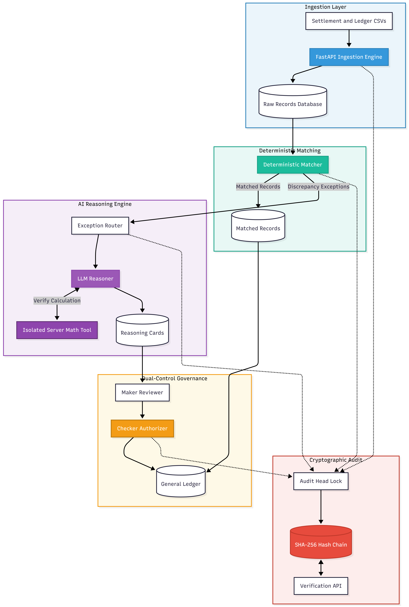

# Recon.ai — Multi-Source Settlement Reconciler

[](https://fastapi.tiangolo.com)
[](https://reactjs.org/)
[](https://www.typescriptlang.org/)
[](https://www.postgresql.org/)
[](https://docs.pytest.org)
[](LICENSE)

> A multi-source settlement reconciliation platform built for payment gateway merchants. Combines deterministic rule matching, function-calling LLM discrepancy reasoning with isolated server-side arithmetic, dual-control Maker-Checker governance, and a cryptographically chained immutable audit log.

---

## 🏗️ System Architecture

<p align="center">
  
</p>

### Core Architectural Layers:
1. **Data Ingestion & Sanitization Layer**:
   - Parses multi-part settlement and merchant ledger CSV exports.
   - Enforces exact currency normalization using quantized `Decimal("0.01")` arithmetic to eliminate floating-point precision drift.
   - Prevents duplicate batch ingestion via idempotency checks (`confirm_overwrite`).

2. **Deterministic Matching Engine (Pass 1)**:
   - Indexes and matches transactions via exact Order ID lookup and multi-key fallback joins (Reference ID + timestamp window).
   - Resolves majority of transaction volume in sub-second execution at zero LLM inference cost.
   - Protected by single-state atomic guards (`WHERE status = 'uploaded'`) returning `HTTP 409 Conflict` on concurrent execution attempts.

3. **AI Discrepancy Reasoning Engine (Pass 2)**:
   - Asynchronously analyzes unmatched exceptions across multiple financial hypotheses (MDR variance, GST rates, partial refunds, flat surcharges, and FX adjustments).
   - Eliminates math hallucinations by delegating all calculations to an isolated server-side `calculate_difference()` tool.
   - Derives objective confidence scores from server-computed residual gaps.
   - Employs a 5-minute lease timeout with auto-reclamation and commit chunking (`CHUNK_SIZE = 10`) to balance throughput with crash-recovery granularity.

4. **Dual-Control Governance & Journal Posting**:
   - Enforces Segregation of Duties (Maker-Checker) before any discrepancy can post to the financial ledger.
   - Identity check evaluated before state check returns `HTTP 403 Forbidden` on self-authorization attempts.
   - Prevents double-action race conditions via atomic SQL conditional updates (`WHERE status = 'pending_authorization'`).

5. **Cryptographic Forward-Linked Audit Trail**:
   - Logs every lifecycle event (`ingestion_completed`, `matching_completed`, `reasoning_card_generated`, `settlement_approved`, `settlement_rejected`).
   - Implements forward SHA-256 hash chaining (`current_hash = SHA256(prev_hash + payload)`).
   - Serialized append operations via singleton `AuditChainHead` row-level lock.
   - ORM lifecycle event listeners block `UPDATE` and `DELETE` mutations.
   - Provides an automated verification endpoint (`GET /batches/{id}/audit-log/verify`) for continuous tamper detection.

---

## ⚡ Quick Start & Local Setup

### 1. Prerequisites
- Python 3.11+
- Node.js 18+ and npm
- PostgreSQL 14+ (or SQLite default for instant zero-config setup)

### 2. Backend Setup
```bash
cd backend
python -m venv venv
# Windows:
.\venv\Scripts\activate
# Linux/macOS:
source venv/bin/activate

pip install -r requirements.txt
cp .env.example .env

# Start FastAPI backend server
uvicorn backend.main:app --reload --port 8000
```

### 3. Frontend Setup
```bash
cd frontend
npm install
npm run dev
```
Open `http://localhost:5173` (or `http://localhost:3000`) in your browser.

### 4. Running via Docker
```bash
docker-compose up --build
```

---

## 📊 End-to-End Walkthrough

1. **Upload Datasets**:
   - Drag & drop `data/synthetic_batch.csv` (Razorpay settlement export) and `data/ledger.csv` (Merchant order ledger).
   - Click **"Upload & Ingest Batch"**.
2. **Run Deterministic Matching**:
   - Click **"Run Matching"**.
   - Matches records deterministically with zero LLM tokens spent.
3. **Run AI Discrepancy Reasoning**:
   - Click **"Run AI Reasoning"**.
   - Background worker invokes tool-calling reasoning to analyze exceptions, explain valid variances, and flag unresolvable anomalies.
4. **Dual-Control Review & Approval**:
   - Inspect reasoning cards and calculation breakdowns.
   - Propose resolution as Maker and authorize as Checker to post verified ledger entries.
5. **Inspect & Verify Audit Trail**:
   - View the immutable audit log and trigger cryptographic hash chain validation to verify tamper resistance.

---

## 🧪 Automated Testing Suite

Run the full pytest suite:
```bash
pytest -v
```

### Test Coverage Highlights (21 Passed Tests):
- `tests/test_tier1_features.py`: Cryptographic hash chain verification, Maker-Checker dual control & 403 self-authorization guard, atomic status guards, lease timeout reclamation, Decimal precision regressions, and throughput telemetry.
- `tests/test_audit_remediation.py`: Immutability ORM hooks, audit retention on batch delete, and reasoning concurrency guards.
- `tests/test_models.py`: Cross-dialect GUID, relationships, cascade rules, and unique constraints.
- `tests/test_ingestion.py`: CSV parsing, currency normalization, row validation, and summary metrics.
- `tests/test_matching.py`: Order ID matching, fallback joins, and centralized math sanity checks.
- `tests/test_full_pipeline.py`: Complete end-to-end multi-source reconciliation pipeline execution.

---

## 📁 Repository Directory Layout

```
ReconAI/
├── backend/
│   ├── main.py              # FastAPI app definition, CORS, lifespan, and root endpoints
│   ├── config.py            # Environment configuration & settings
│   ├── database.py          # SQLAlchemy engine, SessionLocal, and DB dependencies
│   ├── models.py            # Declarative database models with immutability hooks
│   ├── schemas.py           # Pydantic v2 validation & response schemas
│   ├── ingestion.py         # CSV parsing, currency cleaning, and row validation
│   ├── matching.py          # Deterministic matching engine with centralized math
│   ├── reasoning.py         # LLM discrepancy reasoner with calculate_difference tool
│   ├── audit.py             # Cryptographic hash chain audit logger
│   ├── security.py          # API key authentication dependency
│   ├── logging_config.py    # Structured logging configuration
│   └── routes/
│       ├── batches.py       # Upload, batch summary, and audit log endpoints
│       ├── reconciliation.py # Matching, async reasoning, approval & authorization
│       └── reports.py       # Accuracy evaluation & confusion matrix
├── frontend/
│   ├── src/
│   │   ├── components/
│   │   │   ├── Header.tsx               # App bar with quick actions & status pill
│   │   │   ├── PipelineStepper.tsx      # 4-stage interactive pipeline progress
│   │   │   ├── UploadPanel.tsx          # Dual dropzone file upload interface
│   │   │   ├── MatchRateSummaryCard.tsx # Match rate & exception KPI stat cards
│   │   │   ├── ExceptionList.tsx        # Filterable reasoning cards container
│   │   │   ├── ReasoningCard.tsx        # Discrepancy explanation & math drawer
│   │   │   ├── AuditLogViewer.tsx       # Immutable audit log stream with verify action
│   │   │   └── AccuracyReportModal.tsx  # Confusion matrix modal
│   │   ├── App.tsx          # Main application orchestration
│   │   └── api.ts           # Axios / Fetch client layer
├── data/
│   ├── synthetic_batch.csv  # Synthetic settlement file
│   ├── ledger.csv           # Matching merchant order ledger
│   └── ground_truth.csv     # Independent evaluation dataset
├── pics/                    # Architecture diagrams (PNG, SVG)
├── docs/                    # Technical specifications (PRD, TRD, Schema, App Flow)
├── tests/                   # 21 automated Pytest test suites
├── Dockerfile               # Production container image
├── docker-compose.yml       # Multi-container orchestration
└── README.md                # Project documentation
```
