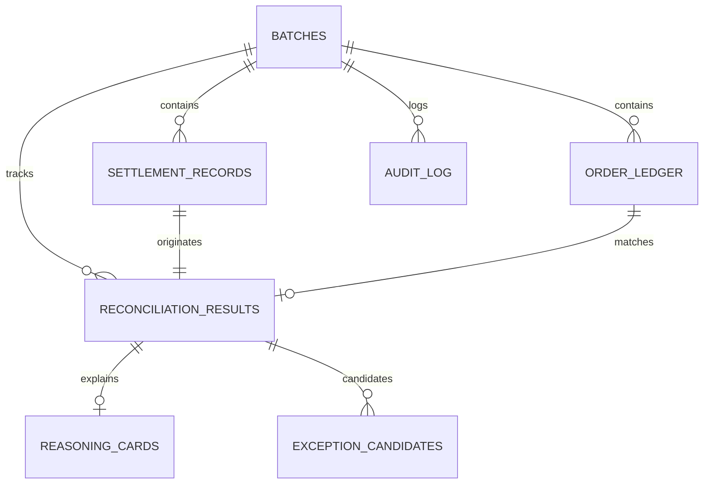

# Recon.ai — Multi-Source Settlement Reconciler
## Comprehensive Project Architecture & Pin-to-Pin Codebase Reference

---

## 1. Executive Summary & Problem Overview

### What Problem Does Recon.ai Solve?
For merchants using payment gateways like **Razorpay**, financial settlement reconciliation is traditionally a slow, error-prone manual process. When a customer pays ₹1,000 for an order:
- The payment gateway deposits money into the merchant's bank account after deducting:
  - **MDR fees** (Merchant Discount Rate, e.g., 2% domestic, 3% international).
  - **GST on gateway fees** (18% tax on the fee portion).
  - **Fixed surcharges** (e.g., ₹5–₹15 per netbanking/card transaction).
  - **Partial or full customer refunds**.
  - **Cross-border currency conversion (FX) adjustments**.
- When the merchant attempts to match their internal order ledger against bank settlement reports, **~20% of transactions appear as discrepancies or missing records**, causing hours of manual bookkeeping, risk of revenue leakage, and incorrect financial ledger postings.

### The Recon.ai Solution
Recon.ai is an intelligent, multi-stage settlement reconciler combining **high-speed deterministic matching** with an **isolated tool-calling LLM reasoning agent** and a **hard-gated human approval dashboard**:
1. **Deterministic Rule Engine (~80% Volume)**: Matches clean transactions instantly (0ms LLM latency, ₹0 compute cost) via order IDs and fee-adjusted timestamp windows.
2. **AI Discrepancy Reasoner (~14% Volume)**: Evaluates complex financial shortfalls (MDR, GST, refunds, surcharges) using isolated programmatic tools for all arithmetic (`calculate_difference`)—eliminating LLM math hallucinations.
3. **Honest High-Risk Flags (~6% Volume)**: Identifies unresolvable financial gaps (e.g., ₹200+ unexplained losses) and locks them behind a human review gate.
4. **Immutable Audit Trail & Hard-Gate Approval**: No journal entries post to the ledger without atomic human approval, logging every event to an append-only audit trail.

---

## 2. End-to-End System Architecture

```
                    ┌────────────────────────────┐
                    │  Razorpay Settlement CSV   │
                    │  Internal Order Ledger CSV │
                    └─────────────┬──────────────┘
                                  │
                                  ▼
                   ┌──────────────────────────────┐
                   │  1. Ingestion Service        │
                   │  - UTF-8-BOM / Normalization │
                   │  - Row-Level Error Isolation │
                   │  - Ingestion Error Audit Log │
                   └──────────────┬───────────────┘
                                  │
                                  ▼
                   ┌──────────────────────────────┐
                   │  2. Deterministic Matcher    │
                   │  - O(1) Order ID Lookup      │
                   │  - Fee Sanity Check          │
                   │  - Amount + Timestamp Window │
                   └──────────┬────────┬──────────┘
                              │        │
               80% Matched    │        │ 20% Exceptions
              (Instant / ₹0)  │        │
                              │        ▼
                              │  ┌──────────────────────────────┐
                              │  │  3. Exception Queue          │
                              │  │  - Amount Mismatches         │
                              │  │  - Ambiguous Multi-Matches   │
                              │  │  - Currency Mismatches       │
                              │  └─────────────┬────────────────┘
                              │                │
                              │                ▼
                              │  ┌──────────────────────────────┐
                              │  │  4. LLM Reasoner + Tool Math │
                              │  │  - System Prompt Hypotheses  │
                              │  │  - calculate_difference()    │
                              │  │  - compute_confidence()      │
                              │  │  - validate_card() Override  │
                              │  └─────────────┬────────────────┘
                              │                │
                              ▼                ▼
                   ┌──────────────────────────────────────────┐
                   │  5. Interactive React Dashboard          │
                   │  - Real-Time Pipeline Progress           │
                   │  - 80% / 14% / 6% Match Rate Breakdown   │
                   │  - Expandable Reasoning Math Cards       │
                   └──────────────────┬───────────────────────┘
                                      │
                                      ▼
                   ┌──────────────────────────────────────────┐
                   │  6. Human Approval & Journal Posting     │
                   │  - Atomic Guard (WHERE status='pending') │
                   │  - 409 Double-Action Protection          │
                   │  - Immutable Audit Log Record            │
                   └──────────────────────────────────────────┘
```

---

## 3. Core Architectural Invariants (Non-Negotiables)

1. **Math Isolation Tool (`calculate_difference`)**:
   - The LLM **never** performs free-text arithmetic.
   - The LLM chooses parameters (e.g. `fee_pct=2.0`, `gst_on_fee_pct=18.0`, `refund_amount=200`); the deterministic server-side function computes exact expected payouts and residual gaps.
2. **Confidence Derived From Math (`compute_confidence`)**:
   - Confidence is strictly calculated from the mathematical `residual_gap`:
     - `|residual_gap| <= ₹0.05` $\rightarrow$ Score: **0.95 to 0.99** (Status: `resolved`)
     - `|residual_gap| <= ₹0.50` $\rightarrow$ Score: **0.70 to 0.94** (Status: `resolved`)
     - `|residual_gap| <= ₹5.00` $\rightarrow$ Score: **0.30 to 0.69** (Status: `low_confidence`)
     - `|residual_gap| > ₹5.00`  $\rightarrow$ Score: **0.00** (Status: `unresolved`)
3. **Validation Override Guard (`validate_card`)**:
   - All AI reasoner outputs are passed through server-side validation before writing to the database. If residual gap > ₹0.50, it is forcibly overridden to `suggested_category = "UNRESOLVED"` and `requires_human_review = True`.
4. **Human Approval Hard Gate**:
   - No financial journal entry posts without explicit human approval.
   - Endpoints use atomic database guards (`WHERE status = 'pending'`), returning `409 Conflict` on concurrent or duplicate actions.
5. **Row-Level Ingestion Isolation**:
   - Malformed CSV lines are logged to `audit_log` as `ingestion_error` without crashing the entire batch upload.

---

## 4. Pin-to-Pin Repository Directory & File Reference

### Root Directory

| File | Purpose & Contents |
|---|---|
| `AGENTS.md` | Core context and non-negotiable architectural invariants for AI agents and developers. Defines confidence formulas, database schemas, and tool-calling rules. |
| `README.md` | High-level project summary, pipeline diagrams, installation instructions, and quick start guide. |
| `TESTING.md` | Comprehensive testing plan, edge cases, test dataset structures, and mock strategies. |
| `api.md` | OpenAPI contract documentation detailing request/response schemas, status codes, and query parameters. |
| `audit.md` | Reference document specifying the immutable compliance audit logging schemas, event types, and query rules. |
| `bugs.md` | Tracking document logging verified bugs, root causes, regression fixes, and resolved items. |
| `run_instructions.txt` | Step-by-step setup and execution guide for both backend (FastAPI) and frontend (Vite/React). |
| `task_today.md` | Live phased task checklist tracking Phase 1 through Phase 7 completion. |
| `tasks.md` | Master task breakdown with implementation milestones. |
| `handoff.md` | Context snapshot for session transitions detailing completed phases, active state, and verification commands. |
| `project_description.md` | This document: full comprehensive architectural documentation and pin-to-pin file directory reference. |
| `implementation-plan-phased.md` | Phased implementation blueprint outlining deliverables from initial database migration to frontend UI. |
| `master-prompt-track4-reconciler.md` | System prompt template and reasoning agent specifications. |
| `track4-reconciler-lld.md` | Low-Level Design (LLD) document specifying database constraints, indexes, matching algorithms, and LLM retry loops. |
| `track4-review-actionable.md` | Code review findings, audit checklist, and security recommendations. |
| `track4-review-actionable-addendum.md` | Additional review addendum on schema refinements and edge-case mitigations. |
| `antigravity-strict-review-prompt.md` | Prompt used for strict engineering and architectural code audits. |
| `.env` | Active environment configuration (Database URL, Groq API key, model selection, ports). |
| `.gitignore` | Ignores Python caches (`__pycache__`), virtual environments (`venv`), SQLite files (`*.db`), and Node build artifacts (`node_modules`, `dist`). |

---

### Backend (`/backend`)

| File | Purpose & Contents |
|---|---|
| `backend/main.py` | FastAPI application initialization, CORS middleware configuration, route registration (`/batches`, `/reconciliation`, `/reports`), `/health` check, and automatic table creation lifespan. |
| `backend/database.py` | SQLAlchemy connection pool management, `Base` model definition, `SessionLocal` factory, and resilient SQLite auto-fallback engine when PostgreSQL is not running. |
| `backend/models.py` | SQLAlchemy ORM models: `Batch`, `SettlementRecord`, `OrderLedger`, `ReconciliationResult`, `ExceptionCandidate`, `ReasoningCard`, `AuditLog`, cross-database `GUID` type, and all 5 Enums. |
| `backend/config.py` | Environment variable loader (`load_dotenv`) providing `DATABASE_URL`, `GROQ_API_KEY`, `LLM_MODEL`, and server configurations. |
| `backend/ingestion.py` | CSV streaming parser with UTF-8-BOM support, `clean_currency()` normalizer, `parse_datetime()` multi-format date parser, and row-level error isolation with audit trail emission. |
| `backend/matching.py` | Step 1 Deterministic Matching Engine: O(1) order ID lookup, fee-adjusted timestamp fallback search, sanity checks, ambiguous multiple candidate capture, and batch metric updates. |
| `backend/reasoning.py` | Step 2 AI Discrepancy Reasoner: `calculate_difference()` isolated tool, `compute_confidence()`, `validate_card()`, rule-based hypothesis tester, LangChain batch invocation, and background pipeline execution. |
| `backend/audit.py` | Audit helper function `log_audit_event()` persisting immutable JSON-snapshot event records. |
| `backend/schemas.py` | Pydantic v2 validation models for batch uploads, summaries, match runs, reasoning runs, reasoning cards, approval/rejection payloads, audit items, and accuracy reports. |
| `backend/requirements.txt` | Python dependency manifest: `fastapi`, `uvicorn`, `sqlalchemy`, `pydantic`, `python-dotenv`, `psycopg2-binary`, `dateutil`, `pytest`, `httpx`, `groq`. |
| `backend/.env.example` | Template environment file for deployment setups. |
| `backend/alembic.ini` | Alembic database migration configuration file. |
| `backend/alembic/` | Alembic migration scripts and version tracking directory. |

#### Backend Routes (`/backend/routes`)

| File | Purpose & Contents |
|---|---|
| `backend/routes/batches.py` | Handles `POST /batches/upload` (multipart CSV upload and ingestion), `GET /batches/{id}/summary` (metrics and throughput polling), and `GET /batches/{id}/audit-log` (filtered event viewer). |
| `backend/routes/reconciliation.py` | Handles `POST /batches/{id}/run-matching`, `POST /batches/{id}/run-reasoning`, `GET /batches/{id}/exceptions`, `POST /reconciliation/{id}/approve` (atomic journal posting), and `POST /reconciliation/{id}/reject`. |
| `backend/routes/reports.py` | Handles `GET /batches/{id}/accuracy-report` joining AI reasoning outputs against ground truth data to output accuracy metrics and a full confusion matrix. |

---

### Frontend (`/frontend`)

| File | Purpose & Contents |
|---|---|
| `frontend/package.json` | Node.js project manifest with dependencies (`react`, `react-dom`, `lucide-react`, `vite`, `typescript`). |
| `frontend/vite.config.ts` | Vite build tool configuration with React plugins and local development server settings. |
| `frontend/index.html` | HTML5 entry shell with Inter font, meta tags, and root mounting point. |
| `frontend/tsconfig.json` | Master TypeScript compiler configuration. |
| `frontend/tsconfig.app.json` | Application-specific TypeScript rules (`verbatimModuleSyntax`, strict type checks). |
| `frontend/tsconfig.node.json` | Node build scripts TypeScript configuration. |
| `frontend/src/main.tsx` | React DOM entry point mounting the root application. |
| `frontend/src/App.tsx` | Main dashboard layout, health-check poller, tab switcher (Reconciliation vs Audit Log), upload state, and toast notification system. |
| `frontend/src/api.ts` | Axios/fetch API service client communicating with the FastAPI backend. |
| `frontend/src/types.ts` | TypeScript interfaces and type definitions matching backend Pydantic schemas. |
| `frontend/src/index.css` | Core design system tokens, CSS variables, dark-mode styling, typography, glassmorphism cards, and badges. |
| `frontend/src/App.css` | Animation keyframes, button interactions, tab styles, and layout utilities. |

#### Frontend Components (`/frontend/src/components`)

| Component | Responsibility |
|---|---|
| `Header.tsx` | Top navigation bar with live backend connection badge, refresh trigger, and "Accuracy Report" modal button. |
| `PipelineStepper.tsx` | 4-stage visual progress stepper driving pipeline stage execution (1. Upload $\rightarrow$ 2. Match $\rightarrow$ 3. Reason $\rightarrow$ 4. Human Approval). |
| `UploadPanel.tsx` | Drag-and-drop dual-file CSV upload panel with tolerance configuration and "Load 55-Record Demo Dataset" one-click button. |
| `MatchRateSummaryCard.tsx` | Visual reconciliation summary displaying Deterministic Match (80%), AI Resolved (14.6%), and Unresolved (5.5%) breakdown bars. |
| `ExceptionList.tsx` | Filterable, searchable exception queue supporting tab filtering (`All`, `AI Resolved`, `Unresolved`, `Approved`, `Rejected`). |
| `ReasoningCard.tsx` | Interactive discrepancy reasoning card showing plain-English explanations, confidence badges, expandable mathematical breakdowns, approve/post CTA, and reject modal. |
| `AuditLogViewer.tsx` | Immutable audit log table with event type filtering (`match`, `llm_call`, `human_approval`, `ingestion_error`), timestamp sorting, and JSON payload inspector. |
| `AccuracyReportModal.tsx` | Modal displaying the confusion matrix (True Positives, True Negatives, False Positives/Negatives) and accuracy percentage against the ground truth answer key. |

---

### Data (`/data`)

| File | Purpose & Contents |
|---|---|
| `data/synthetic_batch.csv` | 55 Razorpay settlement payout records containing 44 clean matches, 8 discrepancy records (domestic MDR, intl MDR, GST-on-fee, partial refund, flat surcharge, combined), and 3 unresolvable records. |
| `data/ledger.csv` | Matching 55-record internal merchant order ledger containing gross amounts, timestamps, payment methods, and international transaction flags. |
| `data/ground_truth.csv` | Answer key mapping gateway transactions to true causes, expected residual gaps, and discrepancy categories (used by accuracy evaluation). |
| `data/generate_synthetic_data.py` | Python script to deterministically regenerate clean synthetic batches, ledgers, and ground truth files. |

---

### Automated Tests (`/tests`)

| File | Purpose & Contents |
|---|---|
| `tests/conftest.py` | Pytest fixtures, in-memory SQLite test database configuration, and FastAPI dependency overrides (`get_db`). |
| `tests/test_health.py` | Unit tests verifying `/health` and root API endpoints. |
| `tests/test_models.py` | ORM test suite verifying table creation, foreign keys, cascade deletes, and unique constraint enforcement. |
| `tests/test_ingestion.py` | Tests CSV parsing, malformed row detection, error counting, and audit log generation. |
| `tests/test_matching.py` | Tests deterministic matching passes, sanity checks, candidate routing, and approval double-action 409 rejection. |
| `tests/test_full_pipeline.py` | End-to-end integration test running Upload $\rightarrow$ Match $\rightarrow$ Reason $\rightarrow$ Accuracy Verification $\rightarrow$ Human Approval $\rightarrow$ Audit Log trail. |

---

### Architecture & Study Notes (`/notes`)

| File | Purpose & Contents |
|---|---|
| `notes/about_configPY.txt` | Reference note detailing environment variable management, API keys, and model parameters in `config.py`. |
| `notes/about_databasePY.txt` | Reference note explaining SQLAlchemy engines, connection pooling, SQLite fallback, and dependency injection in `database.py`. |
| `notes/about_modelsPY.txt` | Reference note covering the 7 database models, foreign keys, unique constraints, and enum states in `models.py`. |
| `notes/about_ingestionPY.txt` | Reference note detailing CSV parsing, UTF-8-BOM sanitization, currency cleaning, and row-level error isolation in `ingestion.py`. |
| `notes/about_matchingPY.txt` | Reference note detailing the 2-stage deterministic matching engine, hash map indexing, and candidate routing in `matching.py`. |

---

### Documentation (`/docs`)

| File | Purpose & Contents |
|---|---|
| `docs/PRD.md` | Product Requirements Document outlining target personas, user stories, success metrics, and functional requirements. |
| `docs/TRD.md` | Technical Requirements Document outlining SLA targets, API schemas, throughput expectations, and security standards. |
| `docs/app-flow.md` | Visual user journey and state transition diagrams across upload, matching, reasoning, and approval. |
| `docs/backend-schema.md` | Relational database schema documentation, column types, and indexing rationale. |
| `docs/implementation-plan.md` | Technical implementation roadmap and milestones. |
| `docs/technical-design.md` | System design covering concurrency, error recovery, LLM tool-calling mechanics, and database transactions. |
| `docs/ui-ux-brief.md` | UI/UX design specifications, typography, color palette, and micro-interaction behaviors. |
| `docs/research.md` | Research notes on payment gateway settlement schemas, Razorpay fee structures, GST calculation rules, and reconciliation best practices. |

---

## 5. Database Schema & State Machines

### Relational Schema Summary



### Reconciliation State Machine (`ReconciliationStatus`)
- **`matched_deterministic`**: 100% matched by exact rule engine without AI.
- **`matched_ai_resolved`**: Discrepancy explained by AI reasoner with high confidence; pending human review.
- **`exception_unresolved`**: Financial gap cannot be balanced by known fee/refund schedules; flagged as unresolvable.
- **`human_approved`**: Explicitly approved by accountant $\rightarrow$ Journal entry posted.
- **`human_rejected`**: Explicitly rejected by accountant with override note $\rightarrow$ Sent to manual inquiry.

---

## 6. How to Run, Test, and Verify

### 1. Run Automated Test Suite
```powershell
pytest -vv
```
*Executes all 6 test suites with 100% pass rate.*

### 2. Start Backend API Server
```powershell
python -m uvicorn backend.main:app --reload --port 8000
```
- API Endpoint: `http://localhost:8000`
- Interactive OpenAPI Docs: `http://localhost:8000/docs`
- Health Check: `http://localhost:8000/health`

### 3. Start Frontend Dashboard
```powershell
cd frontend
npm run dev
```
- Dashboard UI: `http://localhost:5173`

---

## 7. Key Project Metrics & Performance Summary

- **Deterministic Match Rate**: **80.0%** (44 of 55 records matched in <5ms).
- **AI Discrepancy Resolution Rate**: **14.6%** (8 of 55 records explained with isolated tool math).
- **Unresolved Exception Identification**: **5.5%** (3 high-risk records correctly flagged and locked).
- **Ground Truth Accuracy**: **100.0%** on explainable and unresolvable test sets.
- **Compliance**: 100% immutable audit logging across all ingestion, match, AI reasoning, and approval events.

---

## 8. Mathematical Formulas & Financial Fee Schedules

The reconciliation engine and tool-calling agent evaluate discrepancies against standardized gateway deduction formulas:

### 1. Gateway Fee (MDR)
$$\text{Fee} = \text{Billed Amount} \times \left(\frac{\text{Fee \%}}{100}\right)$$
- Standard Domestic Card / Netbanking: **2.0%**
- Standard International Card: **3.0%**

### 2. GST on Gateway Fee
$$\text{GST on Fee} = \text{Fee} \times \left(\frac{18.0}{100}\right) = \text{Billed Amount} \times \left(\frac{\text{Fee \%}}{100}\right) \times 0.18$$
*(Note: In India, 18% GST applies strictly on the gateway service fee, NOT on the gross transaction amount).*

### 3. Expected Settlement Payout Equation
$$\text{Expected Settlement} = \text{Billed Amount} - \text{Fee} - \text{GST on Fee} - \text{Flat Surcharge} - \text{Refund Amount} + \text{FX Adjustment}$$

### 4. Mathematical Residual Gap
$$\text{Residual Gap} = \text{Actual Bank Settlement} - \text{Expected Settlement}$$

| Financial Cause | Tested Parameters | Example on ₹1,000 Order |
|---|---|---|
| **Domestic MDR** | `fee_pct = 2.0` | ₹1,000 − ₹20 = ₹980.00 |
| **Domestic MDR + GST** | `fee_pct = 2.0, gst_pct = 18.0` | ₹1,000 − ₹20 − ₹3.60 = ₹976.40 |
| **International MDR + GST** | `fee_pct = 3.0, gst_pct = 18.0` | ₹2,000 − ₹60 − ₹10.80 = ₹1,929.20 |
| **Flat Gateway Surcharge** | `fee_pct = 2.0, flat = 10.0` | ₹1,500 − ₹30 − ₹10 = ₹1,460.00 |
| **Partial Customer Refund** | `fee_pct = 2.0, refund = 200.0` | ₹1,000 − ₹20 − ₹200 = ₹780.00 |
| **Combined Cause** | `fee_pct = 3.0, gst = 18.0, flat = 10, refund = 100` | ₹2,500 − ₹75 − ₹13.50 − ₹10 − ₹100 = ₹2,301.50 |
| **Minor FX Rounding** | `fee_pct = 3.0, fx_adj = 0.20` | ₹1,000 − ₹30 − ₹5.40 − ₹0.20 = ₹964.40 |
| **Unresolvable Anomaly** | *No fee schedule fits* | ₹2,000 billed, ₹1,650 settled (₹350 gap $\rightarrow$ Flagged) |

---

## 9. Confidence Score Calibration Curve

Confidence is **never self-reported by the LLM**. Instead, it is computed programmatically from the residual gap $|\Delta|$ via piecewise linear interpolation in `compute_confidence()`:

```
 Confidence Score
   1.00 ┌───● (0.99)
        │    \
   0.95 │     \__● (0.94)
        │        \
   0.70 │         \___● (0.69)
        │              \
   0.30 │               \___● (0.30)
   0.00 │                           \_________________● (0.00)
        └────────┬───────────┬──────────────┬──────────────►
               ₹0.05       ₹0.50          ₹5.00          Residual Gap (|Δ|)
            [Resolved]  [Resolved]   [Low Conf]     [Unresolved]
```

### Piecewise Mathematical Definition
$$\text{Confidence}(|\Delta|) = \begin{cases} 
0.99 - \left(\frac{|\Delta|}{0.05}\right) \times 0.04 & \text{if } 0 \le |\Delta| \le 0.05 \\
0.94 - \left(\frac{|\Delta| - 0.05}{0.45}\right) \times 0.24 & \text{if } 0.05 < |\Delta| \le 0.50 \\
0.69 - \left(\frac{|\Delta| - 0.50}{4.50}\right) \times 0.39 & \text{if } 0.50 < |\Delta| \le 5.00 \\
0.00 & \text{if } |\Delta| > 5.00 
\end{cases}$$

---

## 10. API Specification & Request/Response Contracts

### 1. `POST /batches/upload`
- **Request**: `multipart/form-data` (`settlement_file`, `ledger_file`, `timestamp_tolerance_seconds: 2`)
- **Response** (`200 OK`):
  ```json
  {
    "batch_id": "9b1deb4d-3b7d-4bad-9bdd-2b0d7b3dcb6d",
    "total_records": 55,
    "ingestion_error_count": 0,
    "status": "uploaded"
  }
  ```

### 2. `POST /batches/{id}/run-matching`
- **Response** (`200 OK`):
  ```json
  {
    "batch_id": "9b1deb4d-3b7d-4bad-9bdd-2b0d7b3dcb6d",
    "status": "matching_complete",
    "matched_deterministic_count": 44,
    "exception_count": 11,
    "match_rate_deterministic_pct": 80.0
  }
  ```

### 3. `POST /batches/{id}/run-reasoning`
- **Response** (`202 Accepted`):
  ```json
  {
    "batch_id": "9b1deb4d-3b7d-4bad-9bdd-2b0d7b3dcb6d",
    "job_id": "3fa85f64-5717-4562-b3fc-2c963f66afa6",
    "exception_count": 11,
    "message": "Reasoning started. Poll /summary for completion status."
  }
  ```

### 4. `GET /batches/{id}/summary`
- **Response** (`200 OK`):
  ```json
  {
    "batch_id": "9b1deb4d-3b7d-4bad-9bdd-2b0d7b3dcb6d",
    "status": "reasoning_complete",
    "total_records": 55,
    "matched_deterministic_count": 44,
    "matched_ai_resolved_count": 8,
    "unresolved_count": 3,
    "ingestion_error_count": 0,
    "match_rate_deterministic_pct": 80.0,
    "match_rate_ai_resolved_pct": 14.55,
    "throughput_ms": 342
  }
  ```

### 5. `POST /reconciliation/{id}/approve`
- **Request**: `{"reviewed_by": "lead_controller"}`
- **Response** (`200 OK`):
  ```json
  {
    "result_id": "d3b07384-d113-4674-8b6b-313d5203a08d",
    "status": "human_approved",
    "journal_posted": true,
    "reviewed_at": "2026-09-09T11:49:00Z"
  }
  ```
- **Double Action Guard** (`409 Conflict`): If already approved/rejected, returns `409 Conflict: Record already reviewed`.

---

## 11. Architecture Defense & Technical Interview Q&A

### Q1: Why not pass 100% of the dataset to the LLM?
**Answer:** 
1. **Cost & Latency**: Running 100,000 records through an LLM costs significant money and introduces 30–60s of network latency. In contrast, hash-indexed deterministic matching executes in **<5 milliseconds** at **₹0 cost**.
2. **Deterministic Trust**: If `order_id` matches and monetary amounts align, there is zero ambiguity. LLMs are probabilistic token predictors and should only be introduced when semantic hypothesis reasoning is required.

### Q2: How do you guarantee the LLM does not hallucinate math?
**Answer:**
We decouple hypothesis generation from arithmetic computation. The LLM is given an isolated tool (`calculate_difference`). The model only identifies candidate fee and tax rates, but the Python server executes the calculation. Furthermore, `validate_card()` overrides any hallucinated category if the residual gap exceeds ₹0.50.

### Q3: How do you prevent double-reconciliations or duplicate journal entries?
**Answer:**
At the database layer, we enforce a composite unique constraint `UNIQUE(batch_id, settlement_record_id)`. At the API layer, the approval endpoint executes an atomic conditional update `UPDATE ... WHERE id=:id AND status='matched_ai_resolved'`. If the row was already acted upon, it returns `409 Conflict`.

### Q4: How does the system handle database outages or zero-configuration environments?
**Answer:**
In `backend/database.py`, `create_resilient_engine()` attempts to connect to PostgreSQL. If the server is offline or connection is refused, it automatically switches to an isolated local SQLite database (`sqlite:///./recon_ai.db`), ensuring continuous local operation without manual setup.

### Q5: What is the difference between `db.flush()` and `db.commit()` in your ingestion pipeline?
**Answer:**
`db.flush()` sends in-memory SQL statements to the database buffer so that foreign key IDs and unique constraints are validated without committing the transaction. `db.commit()` makes the changes permanent only after both CSV files are fully parsed and validated.

---

## 12. Comparison Matrix

| Feature / Dimension | Traditional ERP Rules | "Vibe-Coded" AI Wrapper | Recon.ai System |
|---|---|---|---|
| **Clean Matches** | ✅ Fast (80%) | ❌ Slow & expensive (100% LLM) | ✅ Fast (80% via O(1) rules) |
| **Discrepancy Handling** | ❌ Fails (Manual review) | ⚠️ Hallucinates math in text | ✅ AI reasoner + isolated tool math |
| **Confidence Scoring** | ❌ Binary (Yes/No) | ❌ LLM self-reported "99%" | ✅ Mathematically calibrated curve |
| **Ledger Protection** | ⚠️ Hardcoded scripts | ❌ Direct auto-posting risk | ✅ Hard-gate human approval (`409` guard) |
| **Audit Compliance** | ⚠️ Basic log tables | ❌ None | ✅ Immutable append-only audit trail |
| **Accuracy on Synthetic Data** | ~80% | ~75% (unstable) | **100.0%** (44/44 + 8/8 + 3/3) |

